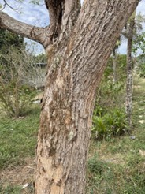
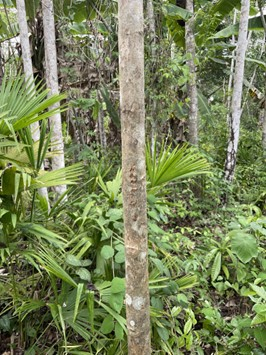

# Tipos de árboles 

## almendro
* su corteza es lizo simple
* hoja larga 
* hoja de color verde limón
* su color es pardo gris

 

## amarillo  
* su hoja es de color verde oscuro, 
* hoja en forma de estrella 
* mucha ramas

 

## bálsamo
* su hoja es redonda puntuaguada 
* su corteza es externa y lisa
* su diámetro oscilan entre 1 m cuando es adulto

## cabimo
* cuando es pequeño no tienen mucha rama
* su hoja es delgada verde claro

## caoba
* Su corteza es delgada rustica
* su vena es de color amarillo palido 
* hoja es verde oscuro con linea amarilla en el centro
  
 

## cedro amargo
* su corteza es liza y delgada cuando es pequeña
* es recto y de poca rama 
* sus ramas son gruesas cuando es adulta 
* su hoja verde claro

## cedro espino
* mucha espina en su corteza  
* muy poca hoja cunado es adulta
* su hoja es casi similar a una estrella 

## cocobolo
* son delgada cuando son pequeños
* hoja verde limón

 

## espave
* muy poca hoja cuando es pequeño
* su hoja es grande y ancho
* corteza gruesa rustica

## guayacán
* su corteza es rustica 
* el color de las hojas es verde limón 
* la flor es de color amarillo y también lo hay en color morado

 

## nazareno
* hoja delgada con linea amarilla en el centro
* corteza liza 

## quira
* cuando es pequeño es delgado 
* su hoja es ancha y de color verde oscuro

## roble
* su hoja es de color verde limón
* hoja ancha
* su corteza es delgada

 

## zorro
* su hoja son delgada de color verde oscuro con linea en el centro de color amarillo
* son hojas pequeña
* su corteza es teza

 
